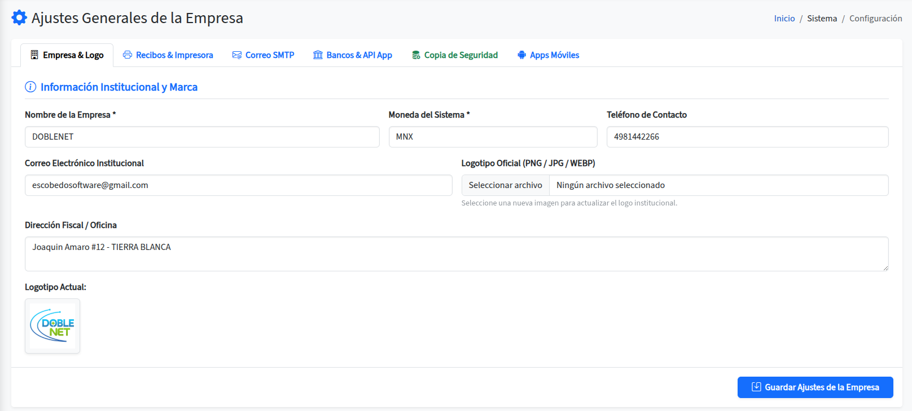

# Configuración de Empresa

El primer paso es ir a la sección de "Ajustes del Sistema > Ajustes de empresa" que esta al lado izquierdo en el menu.

<figure><figcaption></figcaption></figure>

Dentro de esta ventana debemos definir nuestra información como emprendimiento o empresa WISP / ISP para el proceso de actualizacion de datos.

<figure><figcaption></figcaption></figure>

Debemos completar los campos con los datos de nuestra empresa, como el nombre, correo electrónico, teléfono y dirección. Al finalizar, guardamos los cambios para que la información quede actualizada en el sistema.

### Correo SMTP

<figure><figcaption></figcaption></figure>

Esta configuración permite enviar automáticamente el corte de caja diario al correo del administrador. Ingresamos los datos SMTP proporcionados por el servicio de correo, como el servidor, puerto, usuario y contraseña. El sistema utiliza este correo únicamente para enviar estos reportes automáticos.

### API Banxico y Token Movil

<figure><figcaption></figcaption></figure>

Esta sección reúne los datos bancarios y los tokens necesarios para validar pagos y usar la aplicación móvil.

En **Banco**, ingresamos el nombre de la institución donde recibimos los pagos de nuestros clientes. En **Número de cuenta / CLABE**, registramos los 16 o 18 dígitos correspondientes a la cuenta bancaria.

El **Token CPM** es proporcionado por nuestro equipo. Permite validar las transferencias de clientes mediante Banxico para activar o suspender el servicio. Esta función se encuentra en desarrollo.

En **Token móvil**, generamos y copiamos un código de acceso. Este token funciona como una contraseña maestra para acceder desde la aplicación Android a las funciones de cobranza y soporte técnico. Debemos mantenerlo seguro y no compartirlo.

### Copias y restauracion

<figure><figcaption></figcaption></figure>

Esta sección permite crear copias de seguridad de la información del sistema y restaurarlas cuando sea necesario. Antes de realizar una restauración, debemos verificar que el archivo corresponda a la copia correcta, ya que el proceso puede reemplazar los datos actuales.

### Apps moviles / descargas

<figure><figcaption></figcaption></figure>

Esta sección centraliza los enlaces de descarga de las aplicaciones móviles. Desde aquí podemos instalar la aplicación correspondiente según las tareas que realizará cada usuario, como cobranza o soporte técnico.
